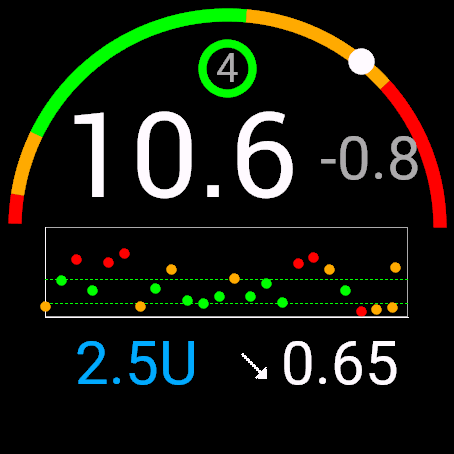
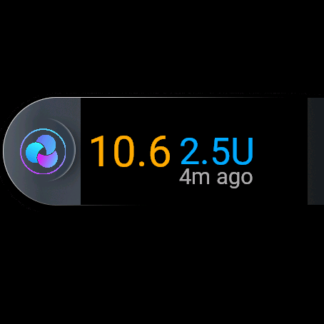

# Trio Garmin App

A Garmin Connect IQ watch app that displays glucose and insulin data pushed from the Trio iOS app.
It shows the current glucose reading on a colour-coded arc gauge, a recent trend graph, insulin on
board, a configurable secondary metric, and how stale the data is.

| Main view | Glance |
|-----------|--------|
|  |  |

Both captures show the same reading, 10.6 mmol/L, four minutes old.

In the main view the arc sweeps `ARC_MIN`..`ARC_MAX` with its five colour zones; the white dot
marks the current value, sitting in the upper yellow band because 10.6 mmol/L (~191 mg/dL) is above
`HIGH`. The ring around `4` is the loop-age indicator, green because the data is under seven
minutes old. Below the reading and its delta, the trend graph plots roughly four hours of history,
each point coloured by its own zone, between the dashed `LOW` and `HIGH` lines. The bottom row is
IOB, the trend arrow, and the configurable metric — here `sensRatio`.

The glance shows the same value in the same zone colour, IOB, and the data age.

## Requirements

- A paired smartphone running Trio with Garmin integration enabled.
- An active Bluetooth connection between phone and watch.

Full Garmin integration is not yet merged into the Trio main release; it currently lives on a
dedicated branch of the Trio repository.

## Supported devices

The manifest declares two products:

- `venu445mm`
- `vivoactive5`

Minimum API level is 3.3.0. Building for any other device requires adding it to `manifest.xml`
first (`Monkey C: Edit Products` in VS Code) and installing its device profile through the SDK
Manager.

## Features

### Main view

- Current glucose value, converted to the display unit, with the delta beside it.
- Arc gauge around the screen, split into five colour zones (see
  [Glucose thresholds](#glucose-thresholds)), with a white indicator dot at the current value.
- Trend graph of recent readings, with dotted lines marking the target range bounds. Points are
  coloured by zone and clamped to the plotted scale so an out-of-range reading stays inside the
  frame.
- Insulin on board, in units.
- Trend direction arrow. `TripleUp` and `TripleDown` are rendered as double arrows; an unknown or
  missing direction falls back to a dedicated icon.
- Configurable secondary metric, selected by the phone through `displayPrimaryAttributeChoice`:
  carbs on board (`cob`), insulin sensitivity factor (`isf`), or sensitivity ratio (`sensRatio`).
  With no selection, the app falls back to the first of `cob`, `isf`, `sensRatio` that is present.
- Loop status ring showing minutes since the last reading, coloured by age:

  | Age | Colour |
  |-----|--------|
  | No data | Light grey |
  | 0–7 min | Green |
  | 8–12 min | Yellow |
  | Over 12 min | Red |

### Glance view

A compact view showing the glucose value (coloured by zone, grey when no reading is available),
insulin on board, and the age of the last reading.

### Background synchronisation

Two paths, selected at runtime from device capabilities:

- **Phone app messages** — the primary path on devices exposing
  `Background.registerForPhoneAppMessageEvent`. The phone pushes data; the app stores it.
- **Temporal events** — a 320-second backup timer registered once at startup. It requests data
  from the phone when the push path has not delivered. The interval leaves a 20-second margin
  after Trio's 300-second loop cycle.

Devices without the modern background API fall back to
`Communications.registerForPhoneAppMessages` and reset the timer on each delivery. Data is kept in
`Application.Storage`, so it survives a watch restart.

## Data contract

The phone stores an array of readings under the `status` key in `Application.Storage`. Index 0 is
the most recent reading and drives every single-value display; the whole array feeds the trend
graph.

```javascript
[{
  "sgv": 130,                                    // glucose, mg/dL
  "date": 1703601234567,                         // timestamp, ms since epoch
  "delta": -7,                                   // glucose change, mg/dL
  "direction": "FortyFiveDown",                  // trend arrow name
  "units_hint": "mgdl",                          // display unit: "mgdl" or "mmol"
  "iob": 2.5,                                    // insulin on board, units
  "cob": 25,                                     // carbs on board, grams
  "isf": 50,                                     // insulin sensitivity factor, mg/dL per unit
  "sensRatio": 0.65,                             // sensitivity ratio
  "tbr": 1.45,                                   // temp basal rate
  "eventualBG": 89,                              // predicted glucose, mg/dL
  "displayPrimaryAttributeChoice": "cob",        // "cob" | "isf" | "sensRatio"
  "displaySecondaryAttributeChoice": "eventualBG"
}, ...]
```

### Units: read this before changing anything

`sgv`, `delta`, `isf` and `eventualBG` are **always sent in mg/dL**. `units_hint` selects only the
unit shown on screen — it never describes the unit of the incoming value.

Everything that reasons about a value (arc position, graph position, zone colour, threshold
comparison) uses the raw mg/dL number. Only rendered text goes through
`GlucoseUnits.formatValue()`, which applies the mmol/L conversion when requested.

Converting before comparing would misclassify every reading: 115 mg/dL is in range, but its
6.4 mmol/L rendering would be classified as a severe hypo. `UnitConversionTest.mc` guards against
exactly that.

### Key naming

The wire format uses `displayPrimaryAttributeChoice` and `displaySecondaryAttributeChoice`.
Internally `TrioView` aliases them to `displayDataType1` and `displayDataType2` when building its
working copy — the aliases are not what the phone sends. Only the primary choice is rendered; see
[Known limitations](#known-limitations).

## Glucose thresholds

All thresholds are in mg/dL and live in `source/constants/GlucoseThresholds.mc`. They are the
single source of truth for the arc gauge, the trend graph and the glance view.

| Constant | Value | Meaning |
|----------|-------|---------|
| `VERY_LOW` | 50 | Below this, hypoglycemia is severe |
| `LOW` | 70 | Lower bound of the target range |
| `HIGH` | 150 | Upper bound of the target range |
| `VERY_HIGH` | 200 | Above this, hyperglycemia is severe |

Five zones derive from those four thresholds:

| Range | Zone | Colour |
|-------|------|--------|
| `< 50` | `ZONE_VERY_LOW` | Red |
| `50 – 69` | `ZONE_LOW` | Yellow |
| `70 – 150` | `ZONE_IN_RANGE` | Green |
| `151 – 200` | `ZONE_HIGH` | Yellow |
| `> 200` | `ZONE_VERY_HIGH` | Red |

Rendering scales are separate from the thresholds:

| Constant | Value | Used by |
|----------|-------|---------|
| `ARC_MIN` / `ARC_MAX` | 40 / 250 | Arc gauge sweep |
| `GRAPH_MIN` / `GRAPH_MAX` | 40 / 310 | Trend graph vertical axis |

Values outside a scale are clamped to its bounds, so they pin to the edge of the frame instead of
being drawn over the rest of the screen. Clamping affects position only — an out-of-scale reading
keeps its own zone colour.

Editing a threshold changes the arc, the graph and the glance together. `GlucoseThresholdsTest.mc`
asserts the ordering and every band boundary.

## Phone-side integration (Trio iOS)

This app is only half of the pairing: the Trio iOS app has to know about it, register it with the
ConnectIQ SDK and push data to it. Two Swift files were changed.

### `Trio/Sources/Models/GarminWatchSettings.swift` — declaring the app

A `trioApp` case was added to the `GarminWatchface` enum. It occupies the settings' "watchface"
slot, exactly as `complication` already does.

- `displayName` — `"trioApp"`, shown in the Garmin settings picker. The picker iterates over
  `allCases`, so the option appears with no further wiring.
- `watchfaceUUID` — `087bee51-ad92-4296-b03b-18f101b5f751`. This is the application ID from
  `manifest.xml`, and it is what the ConnectIQ SDK uses both to register the app and to address
  messages to it. **The two must stay identical**; changing one without the other silently breaks
  delivery.

```swift
case .trioApp:
    return UUID(uuidString: "087bee51-ad92-4296-b03b-18f101b5f751") // Add Application as a watchFaceUUID
```

### `Trio/Sources/Services/WatchManager/GarminManager.swift` — send behaviour

Three changes, each with a distinct purpose.

**1. Historical glucose (`needsHistoricalGlucoseData`)** — `trioApp` joins the targets that receive
a full glucose history rather than the current value alone. This is what feeds the trend graph.

```swift
private var needsHistoricalGlucoseData: Bool {
    currentWatchface == .swissalpine
        || currentWatchface == .complication || currentWatchface == .trioApp
}
```

**2. History depth (`setupGarminWatchState`)** — the fetch limit is raised to 48 readings (~4 h) for
`trioApp`, against 24 for SwissAlpine and Complication, and 2 for the classic Trio watchface (which
only needs the delta).

```swift
// Fetch glucose - TrioApp needs 48, SwissAlpine/Complication need 24, Trio needs 2 (for delta calculation)
let glucoseLimit = currentWatchface == .trioApp ? 48 : (needsHistoricalGlucoseData ? 24 : 2)
```

That 48-entry array is what `TrioView.drawSGVGraph()` plots.

**3. Dedup cache invalidation (`receivedMessage`)** — the fix that makes refresh work at all. When
the watch sends a `"status"` request, both deduplication hashes are cleared before the send is
triggered:

```swift
// The requesting app may have just launched and missed earlier broadcasts
// (watch apps only receive messages while running), so bypass both dedup
// caches to guarantee it gets a response even if data is unchanged
lastPreparedDataHash = nil
lastSentDataHash = nil
```

Without this, an app that has just started receives nothing when the data has not changed since the
last broadcast. A watch face runs continuously and therefore never misses a broadcast; a watch app
does not, so it must be able to ask for the current state and actually get an answer. This is the
phone-side counterpart of the 320 s backup temporal event described under
[Background synchronisation](#background-synchronisation).

These changes live on the dedicated Trio branch mentioned under [Requirements](#requirements), not
in the main release.

## Configuration

Settings are exposed through Garmin Connect Mobile or Garmin Express.

| Setting | Effect |
|---------|--------|
| Primary Color | Colour of the glucose value and the secondary metric |
| Background Color | **Declared but never read** — changing it has no effect |

The `UseMilitaryFormat` property is declared in `resources/settings/properties.xml` but is not read
anywhere in the source either.

## Installation

### Sideload a built `.prg`

1. Build a release binary (`make release`) or use a provided `.prg`.
2. Connect the watch by USB.
   - **macOS**: set the watch USB mode to MTP and use Android File Transfer, or mount it as a
     drive named `GARMIN`.
   - **Windows**: the watch appears as a `GARMIN` drive.
3. Copy the `.prg` into `GARMIN/APPS`.
4. Eject safely, wait for writes to finish, then disconnect.
5. Launch the app from the watch app menu.

`make deploy` automates the copy when the watch is mounted; the destination defaults to
`/Volumes/GARMIN/GARMIN/APPS/` and is overridable through `DEPLOY`.

## Development setup

### Prerequisites

- Visual Studio Code with the Monkey C extension.
- Garmin Connect IQ SDK.
- Device profiles for `venu445mm` and/or `vivoactive5`, installed with `Monkey C: Open SDK Manager`.
- A developer key, generated with `Monkey C: Generate a Developer Key`.

### Configuration files

| File | In git | Read by the build |
|------|--------|-------------------|
| `properties.mk` | Yes | Yes — shared defaults |
| `ConfigOverride.local` | No | Yes — your personal overrides |
| `Config.local` | Yes | **No** — `properties.mk` only includes `ConfigOverride.local` |

Only `ConfigOverride.local` overrides the defaults. Editing `Config.local` has no effect on the
build despite its contents looking authoritative.

Run `./setup.sh` to create `ConfigOverride.local` and auto-detect your SDK path, or write it by
hand:

```make
SDK_HOME = /Users/you/Library/Application Support/Garmin/ConnectIQ/Sdks/connectiq-sdk-mac-8.4.0-...
DEVICE = venu445mm
PRIVATE_KEY = /Users/you/path/to/developer_key
```

Verify with `make show-config`.

### Keep the developer key in sync

`properties.mk` defaults `PRIVATE_KEY` to `$(HOME)/.ssh/developer_key`, while VS Code signs with
whatever `monkeyC.developerKeyPath` points at in its settings. **If those two paths hold different
keys, command-line builds break in a way that looks like nothing happened at all** — see
[Signature check failed](#signature-check-failed).

Set `PRIVATE_KEY` in `ConfigOverride.local` to the same key file VS Code uses.

### Build and run

From VS Code, press `F5`, or use the command palette:

- `Monkey C: Build for Device`
- `Monkey C: Run App`
- `Monkey C: Run Unit Tests`
- `Monkey C: Edit Products`

From the command line:

| Command | Purpose |
|---------|---------|
| `make build` | Build for `DEVICE` |
| `make buildall` | Build for every product in the manifest |
| `make choose` / `make choose-run` | Pick a device interactively |
| `make run` | Build, start the simulator if needed, install |
| `make run-debug` | Same, with the debug build |
| `make sim` | Start the simulator only |
| `make install` | Install to an already running simulator |
| `make test` | Build with `--unit-test` and run the suite |
| `make check` | Type check at level 3 |
| `make release` / `make debug` | Optimised / instrumented builds |
| `make package` | Produce a `.iq` for the Connect IQ Store |
| `make deploy` | Copy to a mounted watch |
| `make clean` | Empty `bin/` |
| `make kill-sim` | Kill stuck simulator and `monkeydo` processes |
| `make devices` / `make validate` / `make show-config` | Inspection helpers |

`make run`, `make test`, `make sim`, `make run-debug` and `make choose-run` share one simulator
bootstrap: it detects a running simulator with `pgrep -x simulator`, launches it detached with
`open -a` when absent, then polls port 1234 until it answers. `SIM_PORT` and `SIM_TIMEOUT` override
the port and the timeout.

The project builds with `project.typecheck = 0` (`monkey.jungle`). `make check` runs at level 3 and
reports a large number of pre-existing findings in the older files; treat it as a review aid, not a
gate.

## Testing

35 unit tests live in `source/tests/`:

| File | Tests | Covers |
|------|-------|--------|
| `GlucoseThresholdsTest.mc` | 8 | Threshold values and ordering, every zone boundary, colour mapping, full-scale sweep |
| `TrioViewTest.mc` | 17 | Malformed payload handling, arc value resolution, graph projection and clamping |
| `UnitConversionTest.mc` | 10 | mg/dL passthrough, mmol/L conversion, unit-independent zoning, glance/main-view agreement |

Run them with `make test` or `Monkey C: Run Unit Tests`. Results print per test, followed by a
summary.

### Writing tests

`Test.assertEqual()` invokes `equals()` on the value under test, which throws when that value is
`null`. Assert a null expectation with a comparison instead:

```monkeyc
Test.assert(view.getEntryDate(null) == null);    // correct
Test.assertEqual(view.getEntryDate(null), null); // throws "Failed invoking <symbol>"
```

Prefer one case per test function: a combined test only ever reports its first failure.

## Architecture

```
source/
  TrioApp.mc                  Application lifecycle, background event registration
  TrioBGServiceDelegate.mc    Background service: phone messages and temporal events
  CommsRelay.mc               ConnectionListener wrapper for transmit callbacks
  TrioView.mc                 Main view: gauge, trend graph, metrics, loop ring
  TrioGlanceView.mc           Glance view
  ArcGoal.mc                  Arc gauge with optional text and icon
  constants/
    GlucoseThresholds.mc      Thresholds, zones, zone colours  (:glance)
    GlucoseUnits.mc           Unit detection, conversion, formatting  (:glance)
    store.mc                  Shared display constants
  core/
    ArcGoalGraphView.mc       Zone-coloured arc rendering and angle mapping
    BaseView.mc               Positionable view base
  modules/
    Device.mc                 Screen geometry, cached at layout
    Vector.mc                 2D vector helper
    StringHelper.mc           String search/replace and padding
  tests/                      Unit tests
```

`GlucoseThresholds` and `GlucoseUnits` are annotated `(:glance)` so the glance view and the main
view share one implementation. Without the annotation the compiler excludes them from the glance
scope and the two views drift apart.

### Rendering notes

- Direction arrow bitmaps are loaded once in the constructor.
- Screen dimensions and the arc gauge object are built once in `onLayout()`; only the displayed
  value changes per frame.
- The whole `status` payload is extracted into one working dictionary per update.
- Incoming data is untrusted: `getArcValue()` and `getEntryDate()` validate types before values
  reach the gauge or the graph, so a malformed entry is skipped instead of crashing the render.

## Simulator test data

`TrioApp.onStart()` calls `seedSimulatedData()`, which writes a synthetic `status` array into
storage — one recent reading plus 23 randomised points — so the UI can be exercised without a
phone. Timestamps are relative to now, so the loop-age indicator stays meaningful across restarts.

Nothing needs commenting or uncommenting: the function exists in two build-gated variants, and the
compiler links exactly one of them.

| Variant | Included in | Behaviour |
|---------|-------------|-----------|
| `(:debug) seedSimulatedData()` | Builds without `--release` | Seeds the synthetic history |
| `(:release) seedSimulatedData()` | Builds with `--release` | Does nothing — waits for the phone |

Connect IQ has no runtime "am I in the simulator" API, so the build flavour is what separates the
two. Verify which variant was linked by looking for `seedSimulatedData` line entries in the
generated `bin/<name>.prg.debug.xml`: a debug build maps it to the seeding body, a release build
maps it to nothing.

| Command | Flavour | Seeds data |
|---------|---------|------------|
| `make build`, `make run`, `make debug`, VS Code `F5` | debug | Yes |
| `make release`, `make package`, `make package-all` | release | No |

**Sideloading a debug build onto a watch will overwrite real readings with fabricated ones.** Build
anything destined for a device with `make release` or `make package`.

Note that `make deploy` currently depends on `build`, not `release`, so it copies a debug binary to
`/Volumes/GARMIN/GARMIN/APPS/` — seeding included. Use `make release` and copy the `.prg` yourself,
or change the `deploy` target to depend on `release`.

## Troubleshooting

### Signature check failed

**Symptom**: `make test` or `make run` reports a successful build, the simulator opens, and nothing
else happens — no test output, a grey window, or the previously installed app running instead of
your new build.

**Cause**: the binary was signed with a different developer key than the one that installed the
app. The simulator rejects it and silently keeps running the old binary. Confirm by reading the
simulator log:

```bash
tail /private/var/folders/*/T/com.garmin.connectiq/GARMIN/APPS/LOGS/CIQ_LOG.YML
```

A rejected install shows `Error: 'Signature check failed on file: ...'`.

**Fix**: point `PRIVATE_KEY` in `ConfigOverride.local` at the same key file as VS Code's
`monkeyC.developerKeyPath`, then rebuild.

### The simulator keeps running an old build

The simulator installs apps into a simulated filesystem and relaunches whatever is already there.
If it is running stale code, clear the installed binaries:

```bash
make kill-sim
rm -f /private/var/folders/*/T/com.garmin.connectiq/GARMIN/APPS/MEDIA/*.PRG
```

Then rebuild and run. Renaming the output file does not help — the simulator keys on the
application ID, not the filename.

### `make run` cannot connect to the simulator

Older revisions detected the simulator with `pgrep -f connectiq`, which also matches the VS Code
Monkey C language server (its java classpath contains the SDK path). Targets then assumed the
simulator was up, skipped starting it, and `monkeydo` failed with `Unable to connect to simulator`.
The current Makefile matches the process name exactly and waits for the control port.

If it still fails, run `make kill-sim`, then `make sim`, and check that port 1234 answers:

```bash
nc -z 127.0.0.1 1234 && echo ready
```

### SDK not found

`make` prints a warning when `SDK_HOME` does not resolve to an SDK containing `bin/monkeyc`. Fix
the path in `ConfigOverride.local` and confirm with `make show-config`. The default in
`properties.mk` may lag behind the SDK you actually installed.

### The app shows only `--`

No usable payload has reached the watch. Check that Trio is running with Garmin integration
enabled, that Bluetooth is connected, and that the phone is not in battery saver mode. The loop
ring is grey when no reading is available and red once data is more than 12 minutes old.

### Device not recognised

Add the product to `manifest.xml` with `Monkey C: Edit Products`, install its profile through the
SDK Manager, and confirm with `make devices`.

## Known limitations

Extracted from the payload or declared in settings, but not implemented:

- `displaySecondaryAttributeChoice`, `tbr` and `eventualBG` are read into the working dictionary
  and never rendered. `tbr.svg` and `eventual.svg` are unused.
- The `Background Color` setting and the `UseMilitaryFormat` property are never read.
- The trend graph's vertical scale is fixed in mg/dL. It plots raw mg/dL values, so it is correct
  in both unit modes, but it carries no axis labels.
- Loop-age colour thresholds (7 and 12 minutes) are hard-coded in `TrioView.getLoopColor()` rather
  than centralised alongside the glucose thresholds.

## License

Part of the Trio diabetes management ecosystem. Refer to the main Trio project for licensing
information.

## Credits

Trio development team. Original watch face converted to the current app, with glance view,
background synchronisation, and shared glucose threshold and unit handling.
