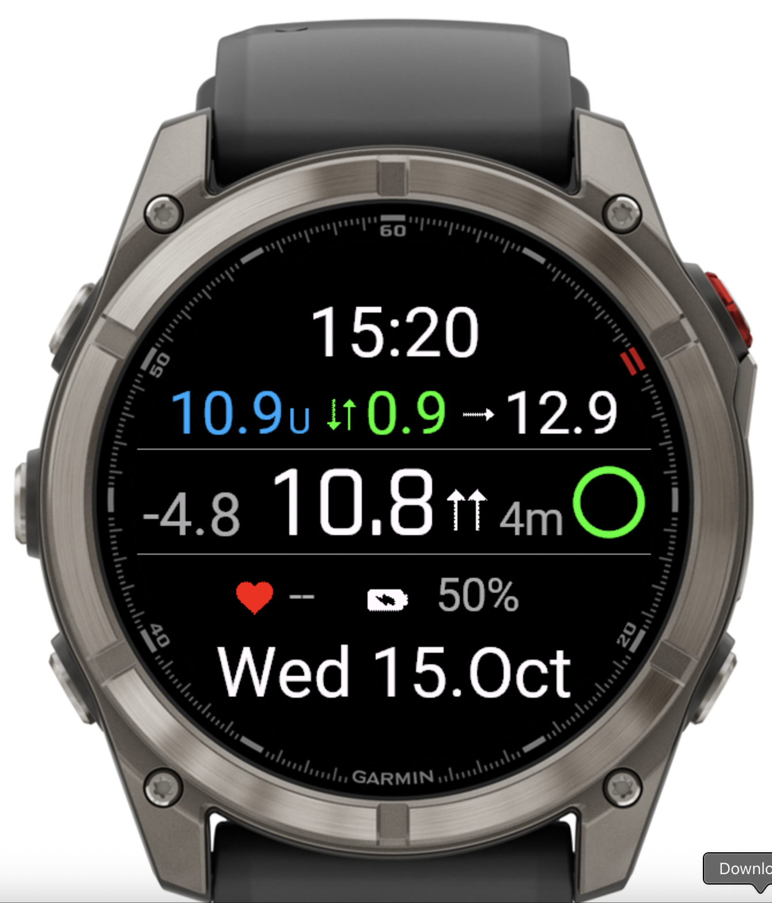
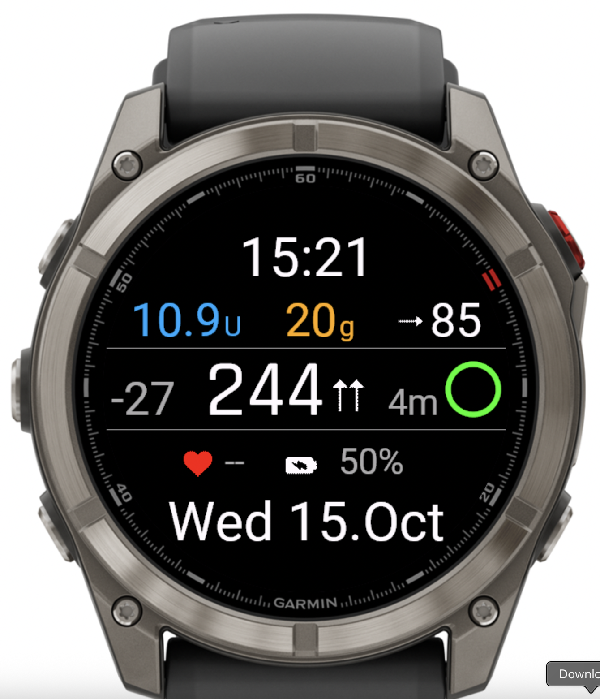

# Trio Garmin Widget

A Garmin Connect IQ widget for real-time diabetes management with Trio system integration. Displays glucose readings, insulin on board (IOB), carbs on board (COB), trend arrows, and loop status directly on your Garmin watch.

 

## Features

### Main Widget View
- **Large Glucose Display**: Current blood glucose value with color-coded arc graph
- **Trend Arrow**: Visual indicator showing glucose direction (rising/falling/stable)
- **Delta Value**: Shows glucose change rate
- **Insulin on Board (IOB)**: Active insulin amount displayed in units
- **Configurable Middle Metric**: Choose between:
  - COB (Carbs on Board) - grams
  - ISF (Insulin Sensitivity Factor)
  - Sensitivity Ratio
- **Loop Status Indicator**: Colored circle showing data freshness
  - Green: 0-7 minutes (current)
  - Yellow: 8-12 minutes (slightly stale)
  - Red: >12 minutes (stale)
  - Gray: No data available

### Glance View
Compact display in Garmin's widget menu showing:
- Current glucose value
- Simple direction arrow symbol (^^, ^, /, -, \, v, vv, ?)
- Loop status age with color-coded freshness

### Background Synchronization
- **Dual-mode sync strategy**:
  - Primary: Phone app message push (every ~5 minutes)
  - Backup: Temporal event polling (320-second intervals)
- **Energy-optimized**: Set-and-forget timer strategy minimizes battery drain
- **Persistent storage**: Data persists between watch restarts

### Unit Support
- **mg/dL**: Standard US glucose units
- **mmol/L**: International glucose units with automatic conversion

## Installation

### Method 1: Sideload PRG File (Easiest)

#### Using Android File Transfer (Mac)
1. Make sure Garmin Express is NOT installed
2. Set USB mode on watch to MTP (Media Transfer Protocol)
3. Connect watch to computer via USB - Android File Transfer starts automatically
4. Drop the `.prg` file into `GARMIN/Apps` folder
5. Quit Android File Transfer and disconnect watch
6. Select the widget from your Garmin watch menu

#### Using Garmin Express (Windows/Mac)
1. Install Garmin Express and configure with your account
2. Connect watch via USB - it should appear as a USB drive named "GARMIN"
3. Navigate to `GARMIN/APPS` folder
4. Copy the `.prg` file to this folder
5. Safely eject the USB storage
6. Wait for write operations to complete, then disconnect watch
7. Select the widget from your Garmin watch menu

### Method 2: Build from Source

See [Developer Setup](#developer-setup) below.

## Usage

### Adding to Your Watch
1. After installation, access the widget menu on your Garmin watch
2. Select "Trio" from the available widgets
3. The widget will display glucose data received from your paired phone

### Configuring Data Source
The widget requires a compatible Trio app running on your paired smartphone. Make sure:
- Trio iOS/Android app is running with Garmin integration enabled
- Bluetooth connection between phone and watch is active
- Phone app has permission to send data to Connect IQ apps

### Customizing Display
Access widget settings through Garmin Connect Mobile or Garmin Express to configure:
- Primary color scheme
- Middle metric display (COB/ISF/Sensitivity Ratio)

## Technical Details

### Application Type
- **Type**: Connect IQ Widget
- **Minimum API Level**: 3.3.0
- **Required Permissions**:
  - Background service
  - Bluetooth Low Energy
  - Communications

### Data Format
The widget receives and stores data with the following structure:
```javascript
{
  "sgv": 130,                    // Sensor glucose value (mg/dL or mmol/L)
  "delta": -27,                  // Change in glucose
  "direction": "DoubleUp",       // Trend direction
  "units_hint": "mgdl",          // Unit system ("mgdl" or "mmol")
  "iob": 10.9,                   // Insulin on board (units)
  "tbr": 1.5,                    // Temporary basal rate multiplier
  "cob": 20,                     // Carbs on board (grams)
  "eventualBG": 85,              // Predicted glucose
  "isf": 100,                    // Insulin sensitivity factor
  "sensRatio": 0.95,             // Sensitivity ratio
  "date": 1703601234567          // Timestamp (ms since epoch)
}
```

### Architecture
- **TrioApp.mc**: Main application class, handles background sync and lifecycle
- **TrioView.mc**: Full-screen widget view with glucose display and metrics
- **TrioGlanceView.mc**: Compact glance menu view
- **TrioBGServiceDelegate.mc**: Background service for data synchronization
- **CommsRelay.mc**: Communication handler between phone and watch
- **ArcGoal.mc**: Circular arc graph component for glucose visualization

### Energy Optimization
- Bitmap caching: Direction arrows loaded once at initialization
- Dimension caching: Screen measurements cached to avoid repeated queries
- Dictionary optimization: Data extracted once per update cycle
- Timer strategy: Set-and-forget approach minimizes background wake-ups

## Developer Setup

### Prerequisites
- **Visual Studio Code** with Monkey C extension
- **Garmin Connect IQ SDK** (version 8.3.0 or later)
- **Garmin device or simulator** for testing

### First Time Setup

1. **Clone the repository**
   ```bash
   git clone <repository-url>
   cd GarminAppPerso
   ```

2. **Run the setup script** (Recommended)
   ```bash
   chmod +x setup.sh
   ./setup.sh
   ```
   
   OR manually create your configuration:
   ```bash
   cp ConfigExample.local Config.local
   # Edit Config.local with your settings
   ```

3. **Install Connect IQ SDK**
   - In VS Code, press `Cmd+Shift+P` (Mac) or `Ctrl+Shift+P` (Windows)
   - Type "Monkey C: Open SDK Manager"
   - Download the latest SDK and your target device profiles

4. **Generate Developer Key**
   - Press `Cmd+Shift+P` / `Ctrl+Shift+P`
   - Type "Monkey C: Generate a Developer Key"
   - Follow the prompts to create your key

5. **Verify configuration**
   ```bash
   make show-config
   ```

6. **Build and run**
   ```bash
   make build    # Build the widget
   make run      # Build and run in simulator
   make help     # See all available commands
   ```

### Configuration Files

#### `Config.local` (Your personal settings - NOT in git)
Contains your personal development settings:
- SDK path
- Preferred device
- Developer key location
- Deploy path

#### `properties.mk` (Shared defaults - IN git)
Contains default settings that work for most developers. Your `Config.local` overrides these.

### SDK Path Examples
- **macOS**: `/Users/YourName/Library/Application Support/Garmin/ConnectIQ/Sdks/connectiq-sdk-mac-8.3.0`
- **Windows**: `C:/Users/YourName/AppData/Roaming/Garmin/ConnectIQ/Sdks/connectiq-sdk-win-8.3.0`
- **Linux**: `/home/yourname/garmin/connectiq-sdk-linux-8.3.0`

### Supported Devices
- Fenix series: `fenix8`, `fenix7`, `fenix6`, `fenix5xplus`
- Enduro series: `enduro3`, `enduro2`, `enduro`
- Epix series: `epix2pro`, `epixpro51mm`
- Venu series: `venu3`, `venu2`, `venu445mm`
- Forerunner series: `forerunner965`, `forerunner955`, `forerunner265`
- Edge cycling computers: `edge1040`, `edge840`

### Useful Make Commands

#### Building
- `make build` - Build for your default device
- `make buildall` - Build for all supported devices
- `make release` - Build optimized release version
- `make debug` - Build with debug symbols

#### Testing
- `make run` - Build and run in simulator
- `make sim` - Just start the simulator
- `make test` - Run unit tests
- `make check` - Run type checking

#### Distribution
- `make package` - Create .iq file for Connect IQ Store
- `make deploy` - Copy to your connected Garmin device

#### Development
- `make clean` - Remove all build artifacts
- `make devices` - List all supported devices
- `make validate` - Check manifest for issues
- `make show-config` - Show current configuration

### Testing with Simulator

The app includes sample data for testing in the simulator. To enable:
1. Open `source/TrioApp.mc`
2. Locate the `onStart()` method
3. Uncomment the line: `//Application.Storage.setValue("status", sampleData);`
4. Build and run in simulator

This will display simulated glucose readings for UI testing.

## Troubleshooting

### SDK Not Found
If you get "SDK not found" warning:
1. Check that Connect IQ SDK is installed
2. Update `SDK_HOME` in `Config.local` with correct path
3. Run `make show-config` to verify

### Simulator Won't Start
If simulator doesn't connect:
1. Make sure no other simulator is running
2. Try `make clean` then `make run`
3. Manually start simulator with `make sim`, then `make install`

### Device Not Supported
If your device isn't recognized:
1. Check device name with `make devices`
2. Ensure device is listed in `manifest.xml`
3. Update Connect IQ SDK to latest version

### No Data Displayed
If widget shows "--" for all values:
1. Verify Trio app is running on your phone
2. Check Bluetooth connection between phone and watch
3. Confirm phone app has Garmin integration enabled
4. Try force-closing and reopening the widget

### Background Sync Not Working
If data stops updating:
1. Verify "Background" permission is enabled in widget settings
2. Check that phone app is not in battery saver mode
3. Restart both watch and phone
4. Re-pair Bluetooth connection if needed

## Contributing

### Adding New Developers
When a new developer joins:
1. Clone the repository
2. Run `./setup.sh` or copy `ConfigExample.local` to `Config.local`
3. Update `Config.local` with their paths
4. Start developing!

No need to modify any shared files or worry about merge conflicts!

### Configuration Priority Order
Settings are loaded in this order (later overrides earlier):
1. `properties.mk` defaults
2. `Config.local` (your main config)
3. `ConfigOverride.local` (optional additional overrides)

## Requirements

### Phone App
This widget requires the Trio diabetes management app running on a paired smartphone with Garmin integration enabled.

### Trio Integration Branch
**Note**: Full Garmin integration requires a special branch of Trio that is not yet merged into the main release. 

In the meantime, you can use:
- The Garmin branch from the Trio repository (for development/testing)
- Popular alternative: SwissAlpine xDrip+/Spike watchface (available in releases)

## License

This project is part of the Trio diabetes management ecosystem. Please refer to the main Trio project for licensing information.

## Credits

**Trio Development Team**
- Original watchface conversion to widget
- Background sync optimization
- Glance view implementation

## Support

For issues, questions, or feature requests:
1. Check the [Troubleshooting](#troubleshooting) section above
2. Review existing GitHub issues
3. Create a new issue with detailed description and logs

## Changelog

### Version 2.1 (Widget Conversion)
- Converted from watchface to widget architecture
- Added glance view for widget menu
- Removed clock/date/heart rate displays (widget-specific)
- Optimized layout for full-screen glucose monitoring
- Implemented text-based direction symbols for glance compatibility
- Enhanced background sync with dual-mode strategy
- Added energy optimization features

### Version 1.0 (Original Watchface)
- Initial watchface implementation
- Basic glucose monitoring with arc graph
- Direction arrows and trend indicators
- Background data synchronization
